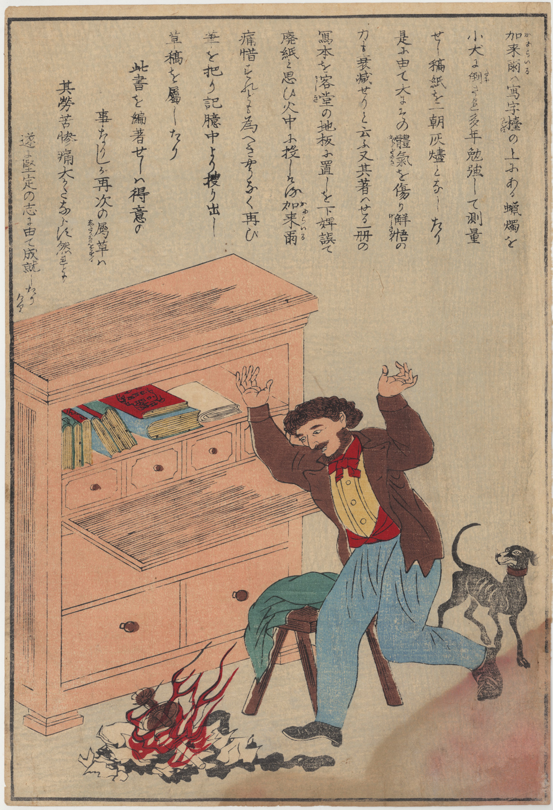

**Ambitious Undertakings by Thomas Carlyle and My Dad** 

*Words delivered at the 2024 Renaissance School Commencement*

**by Sarah Goodbar**

   
Good evening\! I have to tell you: I am a little bit nervous. I was actually feeling fine until about a week ago when I ran into Mr. Tanner outside of the school. He said he was really looking forward to hearing what I had to say in my speech—I was also looking forward to that. He mentioned how nerve-wracking it had been for him to get up on the stage at the Paramount and deliver his graduation speech a couple years back—I hadn't really *thought* about that.  He went on to say that it helped *him* to get his speech finished months ahead of time, just to be sure it was ready. 

*Ehem. . .*   I finished mine. . .  *this* afternoon. 

It was exactly five weeks ago today that I met up with Mr. Harrison at Cville Coffee to discuss the speeches we were going to give. He had three options of what to talk about. This was great. . .  This was exactly *why* I had wanted to meet up with him. . . because what *I* had were various post-it notes with quotes from 19th-century literature,  sections of Wikipedia articles cut and pasted pell-mell into multiple documents, a few personal anecdotes scrawled illegibly in my notebook, and, of course, links to an article or two about the latest AI developments. BUT–*mirabile dictu\!*\--by the time I left Cville Coffee, I basically had an assigned topic to cover. I was going to talk about *my dad.* What a relief\!  

*However,* as I set to work on his story over the coming weeks, a few other things came up. The main one was an anecdote about the time the great English philosopher John Stuart Mill agreed to read Thomas Carlyle’s 745-page manuscript on the French Revolution and then left it lying about where his “maid of all work” mistook it for kindling and used it to start a nice fire in the parlor. *Plus*, I did want to include some Literature and Philosophy shout-outs to the seniors in their last moments as seniors— to quote some Wittgenstein (early and late), throw in a little Plato, mention Kong-zi and the Rectification of Names to see Miles’s reaction—that kind of thing. And *then,* at some point in my preparations, I also got the idea to tell you about Rodney the horse. 

Well. . . 

“No, Sarah,” I said to myself, “That is a bridge too far. You and Damani agreed on a shared theme; you are both writing speeches about your fathers, and Rodney the Horse, pensioned veteran of the Spanish American War, Rodney the horse, heroically wounded during the battle of San Juan Hill, Rodney the horse, Sarah, is only *very* tangentially related to that theme. . . so I *almost* cut Rodney the horse from the speech. . . except that in my mind, I kept hearing Bea’s delighted voice saying,  “You guys. . . I love Rodney the horse\!” So then I was determined to keep him. And after all of that, I was still going to have to find the time to address whether quantum mechanics tended to confirm or deny what I had said. 

All kidding aside, I do want to tell you how seriously and deeply honored I am to have been asked to speak here today along with my good friend Damani Harrison.  Teachers do not *universally* receive the kind of respect these lovely young people have shown the two of us by inviting us here. Thomas Carlyle,  for example–he’s the Scottish novelist and historian whose 745-page manuscript on the French Revolution was burnt up by that famous philosopher, John Stuart Mill– Carlyle, for example, once wrote *this* about his teachers: 

My Teachers," he wrote, were hide-bound Pedants, without knowledge of man's nature, or of boy's; or of aught save their lexicons and quarterly account-books. Innumerable dead Vocables . . . they crammed into us, and called it ***fostering the growth of mind***

Then his emotions got the better of him and he just started throwing out insults:

 ”How can an  inanimate, mechanical Gerund-grinder, the like of whom will, in a subsequent century, be manufactured at Nurnberg out of wood and leather, foster the growth of anything?” 

WELL\!  I have been called a lot of things in the course of my long teaching career (mainly, the B-word), but no one has ever had the audacity to call me “an inanimate mechanical Gerund-grinder. But Carlyle’s wrath was not yet quenched. He goes on\!  

How can an inanimate, mechanical Gerund-grinder, foster the growth of anything? Much more of Mind, which grows, not like a vegetable (by having its roots littered with etymological compost), but like a spirit, by mysterious contact of Spirit; Thought kindling itself at the fire of living Thought? How shall he give kindling, in whose own inward man there is no live coal, but all is burnt out to a dead grammatical cinder?  
   
Hmm. 

Carlyle wrote that in 1831, four years before the little “kindling” incident with John Stuart Mill:  little did he know then *what else* was going to be “burnt out to a dead grammatical cinder\!”  
   
All of that is just to say that I appreciate you guys, you seniors on the brink of not being seniors anymore.   
This is a big transition for you. You are all now in the process of becoming untethered, more or less slowly,  from the old systems you have been a part of and will soon be inserted abruptly into new ones —new schools, new jobs, new housing units, new traffic patterns, new weather systems, new daily schedules, new lunch options. The Renaissance School is about to be part of your origin story, your educational ancestry, and your daily life here is about to drop down a rung on Plato’s Divided Line, and like shadows cast on the wall of a cave, your memories will only provide you with rough outlines of your actual experiences at Renaissance. They will be missing almost all of their complexity  
.    
But that is the nature of consciousness, isn’t it? Anything outside of *this moment*, *here,* in *this place*–the most vivid memories, the most accurate predictions–lacks the texture of all the random irrelevant details of daily life. These are replaced, instantly and effectively, by whatever seems the most relevant. (If you ever find yourself running simulations of what you may be doing this time next year, chances are you are not imagining what the dimensions of your parking space will be or whether it will retain the deep black bitumen-dominated appearance of fresh asphalt or tend more towards a rough gray, due to oxidation.)  And the same will be true when you try to look back on these years. 

What, really,  are memories, if not just simulations in retrospect–relatively simple simulations tinto which we insert a relatively simple simulation of our past self? And although there is a loss in that, a loss of data and complexity,  this ability to intuitively and automatically simplify the complex data of life is precisely why, for now at least (*knock on podium*),  we are— each and every one of us– still smarter than the very smartest of machines. 

Carlyle’s fairly accurate 1831 prediction about artificial intelligence encroaching on the economic value per kilogram of flesh-and-blood grammarians provides a clear example. He got the main idea—what was relevant—right, but everything else (details that were irrelevant anyway), he got wrong. He knew Grammarly would exist, he just thought it was going to be a wood and leather automaton manufactured at Nuremberg. This loss of detail in prediction is pretty obvious, but Carlyle also recognized this phenomenon reaching backwards in time. The protagonist of his masterpiece *Sartor Resartus* says

What printed thing soever I could meet with I read. . . By this means was \[my\] young head furnished with a considerable miscellany of things. . . .  AND SHADOWS OF THINGS.  History in authentic fragments lay mingled with fabulous chimeras, wherein ALSO WAS REALITY.

Believe it or not, these words apply to you all in a most urgent and practical way.  So, let's start by talking about things. . .  and SHADOWS OF THINGS. And then we can get into some fabulous chimeras, wherein we’ll also find REALITY.

I’ve told you the thing that happened to Carlyle on that very real day in 1835 when John Stuart Mill’s enjoyment of his especially toasty parlor turned into sudden horrified dread as he realized just *what* was blazing so brightly in the stove. That event, to us,  is no more than a fragment of the complex reality those two men experienced that day, a mere shadow.  But the story of Caryle’s loss, and particularly his heroic efforts to recreate what had been lost,  became a fable, even within his lifetime. And that fable soon became a chimera, wherein ALSO WAS REALITY. 

The setting of our fable is Japan at the time of the Meiji Restoration, during which the shogunate was being rapidly replaced by modern and westernized forms of government.  The entire nation was being untethered from the old ways and inserted into new systems with their own new stories. 

At this time, the Ministry of Education, quote, “issued a mandate stipulating that ‘in order to improve the education of families with young children, \[…\] the Ministry will produce a variety of art and toy products appropriate for children soon entering schools” and, quote, “as part of this commitment, the Ministry produced and distributed over the course of the next few years, polychrome nishiki-e prints depicting pedagogical themes,” unquote.  One of these polychrome nishiki-e prints depicts the fiery end of Carlyle’s manuscript. 

In the print a man with comical western attire and porkchop sideburns jumps in anguish around fire,  to the dismay of a nervous little black dog who looks on from the right. The fire burns on the floor in front of a writing desk. There is no “maid of all work” to be seen. No stove.  No parlor. No panicky John Stuart Mill.   Rather, looking closely in the fire, one can discern an overturned oil lamp on top of the burning manuscript. It is clear now why the dog looks so nervous. He is the culprit. The manuscript and lamp had clearly been next to each other on the desk, and the little dog most certainly must have knocked them both to the floor.   

Now, I have insider information that the Thomas Carlyle anecdote depicted in this polychrome nishiki-e print is truly a chimera (a new and fantastical creature formed by the melding of two real creatures).  What this print actually shows us, is the manuscript of the 19th-century historian and novelist Thomas Carlyle burning to a grammatical cinder on account of the playful antics of Diamond the Dog, the beloved pet of 17th-century polymath (and co-inventor of calculus) Isaac Newton. 

You see, the story of Carlyle’s heroic determination to rewrite his manuscript had quickly become an inspirational parable and it was included in an 1859 book now credited with launching the self help genre. In that book, aptly named *Self Help*, the author, aptly named Samuel Smiles, includes the story of “the accidental destruction of Sir Isaac Newton’s papers, by his little dog ‘Diamond’” in the same exact paragraph that covers Carlyle’s little kindling incident. Smiles’s collection of stories to encourage personal growth was soon after translated into Japanese and given the telling *new* title: *Ambitious Undertakings by Westerners.*  

 
**Thomas Carlye with Isaac Newton’s dog Diamond.** 

What is important to grasp here, is that the mixing of the two stories into one chimerical fable probably wasn’t an accident. By the time a second-rate nishiki-e printmaker was being paid by the Japanese Ministry of Education to illustrate this story for Japanese school children, the story had ceased to be *about* Carlyle *per se*. Carlyle’s name was relevant, but the details of his particular experience were not. Because the *real* story, the relevant part,  only starts after the manuscript is destroyed, at which point the nature of the accident leading up to it was inconsequential.   

There was no help, Smiles explains, but \[for Carlyle\] to set resolutely to work to re-write the book; and he *turned-to* and did it. He had no draft, and was compelled to rake up from his memory facts, ideas, and expressions, which had been long since dismissed. The composition of the book in the first instance had been a work of pleasure; the rewriting of it a second time was one of pain and anguish almost beyond belief. That he persevered and finished the volume under such circumstances, affords an instance of determination of purpose which has seldom been surpassed.

*That* is the story: the pleasure of writing replaced by the pain and anguish of rewriting,  the determination of purpose seldom surpassed.  Mill was irrelevant. The maid-of-all-work was irrelevant. And though some irrelevant part of the truth was lost by making Isaac Newton’s dog Diamond responsible for the destruction of a manuscript written 200 years after Newton’s death, the relevant truth that the children were meant to understand was made clearer by these very falsehoods. A generation of Japanese school children must have passed this print every day, unaware that within it, history in authentic fragments lay mingled with fabulous chimeras, wherein ALSO WAS REALITY.    
   
As I said earlier, our ability to crystallize the relevant material to fit a given set of needs is a hallmark of human intelligence. But this can also create an expectation that “determination of purpose” or “perseverance” or any other emblematic human virtue will present itself for us in our own lives with the same clarity as an educational print for school children. But when I try to simulate the scenario with a little more complexity, I find myself doubting the whole moral of the story. I find myself doubting whether Carlyle’s heroic efforts were really attributable to some exceptional strength of character or indomitable spirit. My father, for example, is an extremely hardworking and determined person. I would put him up against Carlyle any day of the week. And yet, when his business, which he loved, which he worked hard to build, which represented a triumph over adversity, burnt to the ground in 1979, he didn’t make any effort to rebuild it all. 

In the *Tractatus* (I believe), Wittgenstein wrote that “An object’s property is inherent when it is unthinkable for the object not to have it.”  For Thomas Carlyle, a future in which he was *not* going to be the writer of a 745-page masterwork on the French Revolution was unthinkable. When all of his plans to be the writer of that book were burnt to a grammatical cinder, his ability to move immediately and resolutely forward, it seems to me, was not based on his special resilience as a person, but on the fact that, in the midst of all of the complexities of the real and vivid life around him, his feelings about completing the book were simple. They were as simple as a poster meant to instruct schoolchildren. He must be the writer of that book. 

Now, my father originally wanted to go into aerospace engineering. That’s what he got his diploma in at Brooklyn Technical High School.  But it was complicated. Because much more urgently than he wanted to be an aerospace engineer, he wanted to get as far away from his Polish Catholic upbringing in Greenpoint, Brooklyn—New York City’s Little Poland—as he could. To that end, he ended up living with some friends in the woods of central Maine, where he worked some pretty awful jobs compared to that of an aerospace engineer. A few of you have heard the anecdote about the drunk old doctor who was just sober enough to be recruited to sew up the gash in my dad’s thigh where a chainsaw had fallen on him but who was not *quite* sober enough to get all the pine needles out of the gash first. In addition to his time as a woodsman in the great north woods, my dad also worked in a tannery (as some distant ancestor of our Mr. Tanner surely did). Now, a tannery is where chemicals are applied to hides to make leather, and to understand that job, well, suffice it to say,  it does earn a mention in the greatest work of literature written in English, Shakespeare’s *Hamlet*, when a *gravedigger* explains that while “many pocky corpses will scarce hold the laying in,” a tanner’s “hide is so tanned with his trade” that it “will last you nine year”

So,  my father developed some increasingly strong ambitions to get out from under that kind of manual labor. He *did* want that business that had gone up in flames.  But being the-man-who-had-that-business was not an inherent property of my father. That’s not who my dad is. He is actually a hopeless romantic. Now, before I say much more about my dad,  I have to acknowledge that anyone who knows my dad—and my dad more than anyone— would be highly skeptical about me using any part of the story of his life to “motivate or inspire” teenagers at a high-school graduation. So let’s pretend that that is not my intention here. My dad is a giant, cynical old man with two hip replacements, two knee replacements and, I think, some kind of wrist replacement, and a vocabulary that is even bigger than mine on account of the vast appendix of swear words that he possesses and generously shares with anyone in the vicinity being himself a born educator of sorts. And I am quite sure that when his body shop burned to the ground two years after its grand opening day, a 745-page lexicon of curse words became additional kindling for those effing flames.  

And yet,  my dad did not rebuild.  Amidst the complexity of his life, being the guy with clean fingernails who told a bunch of guys with dirty fingernails what to do was not his one simple truth. What was simple for him was love.

See, back in Maine, long before he ever thought about opening a body shop, my dad, still a teenager himself,  was introduced to a young woman, the girlfriend of a guy he knew, whom we’ll call Brad. Very soon after meeting Brad’s girlfriend, becoming the-man-who-would-marry-Brad’s-girlfriend became an inherent property of my father.  It was unthinkable for my dad that he would NOT end up married to Brad’s girlfriend. So, when my mom moved away from Maine with her boyfriend Brad, my dad did not accept this as the end of the story.  He moved too. 

And When my mom *married* Brad and not my dad,  he also did not accept *that* as the end of the story. He got a job in the new town where *the three of them* now lived (and where I would grow up) and he. . .  just went about his business. 

My mom and Brad got pregnant.   
My dad went about his business.    
The baby (my brother Jody) was born.   
My dad went about his business. 

He just kept on keeping on, even helping out with the baby from time to time because he’s a stand-up guy like that. Then, *maybe two years after that,* when my mom found out that Brad had been cheating on her with college students in the dorm they were supervising, *guess who was there?* 

So,  my dad gave my mom and my brother Jody a place to stay,  no strings attached. There were *never* any strings attached. My dad and mom lived together as friends, caring for my brother together *as friends* for a couple of *years.* And eventually, my mom did fall in love with him. And he finally became the predicate that a full conceptual analysis of himself as a subject could have guaranteed that he would become had Laplace’s demon been around to do the math: my dad became the guy who was married to my mom, Brad’s girlfriend. And my parents are happily married to this day.

So now *your* “young heads have been furnished with a considerable miscellany of things. . . .  AND SHADOWS OF THINGS.”  And I promised you earlier that within these “authentic fragments and fabulous chimeras, there would also be REALITY.” So, In the few minutes remaining in which you are all still American school children, I want to make sure that the collection of stories in this speech, “Ambitious Undertakings by Thomas Carlyle and My Dad” we might call it, do provide *some* clear and simple instructions that will encourage personal growth and kindle the fire of your thoughts. So without further ado, here are the five lessons you are supposed to learn. 

**Lesson 1 of 5: Take care to be the one interpreting your own story.** 

Take care to be the one interpreting your own story. If you don’t, your brain will go ahead and do it for you, even if you don’t ask her to. And you won’t notice it happening. The brain is a very excellent maid-of-all-work in this way,  always shuffling around in the background, quietly getting the work done and leaving you to take the credit for all her hard work and accept the blame for any manuscripts thrown in the fire under her watch.  

But you have the freedom to decide how the raw material of your life will be interpreted yourself, to take this automatic process and voluntarily override it with the force of your will. “The meaning of Life itself,” said Carlyle, randomly also coining the phrase “meaning of life” for the first time, “is no other than Freedom, than Voluntary Force.” 

So, If you love the character you are now and the story you are a part of in your mind, by all means,  double down and, be prepared, if fate should call upon you to do so, to rewrite some vast metaphorical manuscript to protect your storyline.  If you are not so sure,  you can always change the perspective slightly, and see what your life might look like, when viewed from north-by-north-east, say, rather than from true north where you see yourself right now.  You can even, if called to do so from deep, deep within, envision for yourself a radically different story. Of course, we can never originate an entirely new storyline from scratch, independent of any causation—but I firmly believe that it is your destiny to maneuver yourself into a chain of causation based on who you really are.

**Lesson 2 of 5: You belong where you *want* to be.** 

At the beginning of this speech, I *mentioned* that I would have to *mention* quantum mechanics. Now, I have no business discussing quantum mechanics.  I am not “a math person,” to use that funny phrase, which all my Lit Phil students have heard me say repeatedly. And everything I ever read about quantum mechanics assures me that its implications make much more sense in Math than in English.  But my dad is a math person. He is a physics person. When I was a girl he was the one who taught me to read, and, believe it or not, one of the books he would read to me at bedtime was even a pop-up book that showed, in beautiful 3D detail, exactly how a carburetor worked. 

But I have no spatial reasoning.  I can’t visualize images or shapes in my brain. I can’t hold a number in my brain while I try to perform an operation on it. I mean, I have been trying to understand the electromagnetic field for, like, a year, and it's NOT going well. (And If you are seated near my husband Chris in the audience, he can confirm this.)  And yet, despite all of that, I gravitate towards my father’s understanding of the world. And one of the things that has actually made me a good educator is this very experience of turning a corner into another school subject and instantly going from sharp to dull.  Still, I insist on talking about math and physics despite the fact that as an English teacher it is literally built into the job description that you will be talking about and teaching NOT math or physics. 

And it is obviously not that my dad’s math skills give me some genetic right to listen to podcasts about math or physics or computer programming and then incorporate what I hear into my lesson plans. The reason I have a right to do this, the reason I feel like I belong in a conversation where I don’t understand half of what is being said, is because I want very much to belong there.  Wanting to be there, for whatever reason, IS the thing that makes you belong there.  And when you want to go to places where you seem not to belong, that alone is a pretty sure sign that you actually do belong there.

**Lesson 3 of 5:  Being uncomfortable is often fine.** 

Now,  I am 46 years old and I am definitely an English person, an inanimate, mechanical, Gerund-grinding English teacher, no less, and yet I began this speech, making jokes about being behind schedule on my own writing assignment\! About making Mr. Harrison choose a topic for me, and then about failing to stick to that topic. (And at this point, I have to admit that I never did manage to fit “Rodney the horse” into this speech. Sorry, Bea. Please accept “Diamond the dog” in his place. And Miles, that will have to be your Rectification of Names as well: “Diamond the dog” for “Rodney the horse.”

It’s funny now, but it did not feel humorous *at all* when at 10 AM *yesterday,* I *really, actually* still didn't know how all of the ideas in my head and on my laptop and spread across my desk were going to come together into this speech. But I have taken pains to learn to understand myself and the way having ADHD impacts my life very well so I *did* know, without any doubt, that they *would* come together, just in time.   
In fact, I knew those two things from the moment Dr. Johnson called me into her office to tell me that you all had chosen to ask Mr. Harrison and me to speak at your graduation:  I knew both that I would absolutely be able to (and be honored to) do it . . . and also that when the week of the speech came, it was going to be down to the wire and I was going to *almost* not get in done on time, and that as a result I was going to be very, very uncomfortable for while. Uncomfortable, but fine. So, whether you have a disability or not, coming to terms with the sensation of “uncomfortable, but fine” is one of the best things you can do for yourself,  because it allows you to say yes to things that are well within your reach, even when you know they will not be easy. 

**Lesson 4 of 5: Learn your inherent properties.** 

Learn what your inherent properties are and distinguish them from all of the other things: the things you just like or things you just want.  And also learn what you struggle with inherently. I said early on that our memories of our pasts and our predictions for our futures are both simulations that we insert our simulated selves into, stories that we write ourselves into. When Mr. Harrison and I are both done with our speeches, look back and forward from this transitional moment in time and think very hard about who you are, and what you are capable of, and what it would be unthinkable for your life to be without. Then begin the work of writing yourself into a story where what you want, and what you can actually do, and who you inherently are, is exactly what your plotline calls for. 

**Lesson 5 of 5: Not all complexity calls for analysis.** 

Here we are at the end of the speech. There is a special richness of detail, a perfusion of sensory information, open to view in the present moment. Everything that is around us right now, the specifics that I could not predict when I was writing this speech,  and that I cannot express now because your consciousnesses experience them differently than my consciousness does—all of these quali. . .a, I mean, quali. . ties. . . here before us in this moment—*not one of them* actually calls for interpretation or analysis. Looking forward and backward, we turn to simulations or stories to predict the future or explain the past, but in the present moment, that very same saturation of information allows us to stop asking any questions at all. Because, as Wittgenstein says, “When everything is open to view, there is nothing. . .  to explain.”

Good luck, seniors, and congratulations\!

![][image2]  
**Right: My father and I in his parents’ kitchen around 1982\.**  
**Left: My father’s grandfather with Rodney the horse around 1916\.**  

**Sources**

Carlyle, Thomas. *Sartor Resartus*. Edited by Kerry McSweeney and Peter Sabor, Oxford University Press, 1987\.

Culin, Stewart. "Japanese Color Prints Illustrating Samuel Smiles' *Self Help*." *The Brooklyn Museum Quarterly*, vol. 6,   
no. 2, Apr. 1919, pp. 111–116. *Brooklyn Museum*, [https://www.jstor.org/stable/26459132](https://www.jstor.org/stable/26459132).

Moore, M. “The Artillery Horse ‘Rodney.’” *Forums at the Society of the Military Horse*, 7 Apr. 2015,   
[www.militaryhorse.org/forum/viewtopic.php?t=12409](http://www.militaryhorse.org/forum/viewtopic.php?t=12409).

Shakespeare, William. *Hamlet*. Edited by Ann Thompson and Neil Taylor, Revised ed., Arden Shakespeare,   
Bloomsbury, 2016\.

Smiles, Samuel. *Self-Help: With Illustrations of Conduct and Perseverance*. Project Gutenberg, 10 June 1997,   
[www.gutenberg.org/files/935/935-h/935-h.htm](http://www.gutenberg.org/files/935/935-h/935-h.htm).

"Thomas Carlyle." *Legends of Great Westerners*, attributed to the school of Utagawa Kuniteru II, 1873\. Ministry of   
Education, Japan. Accessed via My Japanese Hanga:   
[https://www.myjapanesehanga.com/home/artists/utagawa-kuniteru-ii-1830-1874/thomas-carlyle-from-the-ser](https://www.myjapanesehanga.com/home/artists/utagawa-kuniteru-ii-1830-1874/thomas-carlyle-from-the-series-le-8d542f37e4ed4a98.html)  
[ies-le-8d542f37e4ed4a98.html](https://www.myjapanesehanga.com/home/artists/utagawa-kuniteru-ii-1830-1874/thomas-carlyle-from-the-series-le-8d542f37e4ed4a98.html).

Wittgenstein, Ludwig. *Tractatus Logico-Philosophicus*. Translated by Damion Searls, introduction by Marjorie Perloff,   
Liveright Publishing Corporation, 2024\.
